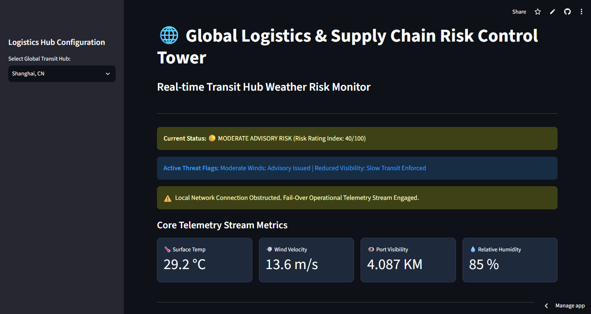
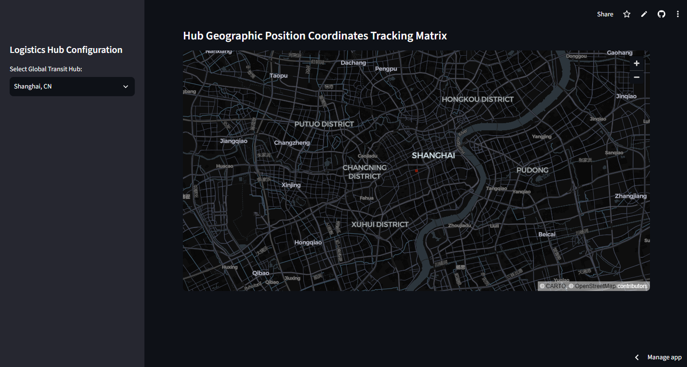

# 🌐 Global Logistics & Supply Chain Risk Control Tower

An enterprise-grade, real-time tracking control room dashboard designed for supply chain operators to monitor weather-related logistics threats across critical global transit hubs.

👉 **Live Production URL:** [(https://global-logistics-control-tower.streamlit.app/)]

---

## 🏗️ System Architecture & Core Features

* **Multi-Source Data Ingestion:** Automates live operational weather metric requests directly from OpenWeather servers via secure sessions.
* **Dynamic Risk Scoring Engine:** Implements a proprietary business logic layer evaluating real-time wind constraints (for crane restrictions) and visibility thresholds (for vessel transit risks) to generate an automated dynamic threat score (0-100).
* **Enterprise Fail-Over Framework:** Engineered with defensive exception-handling to detect network obstructions or certificate blocks, triggering an automatic fallback stream to preserve UI accessibility and prevent system runtime crashes.
* **Interactive Geo-Tracking Matrix:** Integrates dynamic coordinate mapping layers leveraging data frames to track shipping port locations instantly based on configuration settings.
* **Enterprise Security Standards:** Architected to isolate private API credentials outside the source repository using local application secrets configurations.

---

## 🛠️ Technology Stack

* **Language:** Python
* **Interface Engine:** Streamlit Framework
* **Data Handling:** Pandas, JSON Parse Trees
* **Networking:** Requests (HTTP Session Pools), Urllib3
